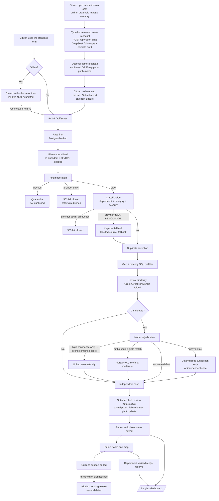

# FixPafos architecture

## What this is

A public map of municipal issues in Pafos. Citizens report a problem in Greek,
English or Russian; the platform moderates it, classifies it, routes it to a
likely responsible service, estimates how urgent it is, checks whether someone
has already reported the same thing, and publishes it. Municipal staff reply
with a verified badge, resolve issues, and read an operational dashboard.

Citizens can use the standard form or an experimental conversational assistant
at `/report/chat`. The assistant gathers context through DeepSeek follow-ups
and optional voice transcripts, then offers camera/upload, GPS/map and review
controls before submitting to the same report endpoint.

It is an independent community platform. It does not dispatch work, and it does
not transmit anything to an authority automatically.

## Stack

| Layer | Choice | Why |
|---|---|---|
| Framework | Next.js 16 (App Router) | Server components for the dashboard, route handlers for the API |
| Database | Postgres (Neon) via `postgres` | JSONB documents plus generated columns for indexed queries |
| Map | MapLibre GL + OpenStreetMap tiles | No proprietary key needed to run |
| Photos | Vercel Blob, private access | Never public; every request is permission-checked |
| Model | DeepSeek via the Anthropic-compatible SDK | Structured tool output with schema validation |
| Experimental chat | Existing DeepSeek client, browser camera, MediaRecorder, SpeechRecognition and geolocation | Guided drafting with explicit user control of media, location and publication |
| Charts | Hand-rolled inline SVG | Four small forms did not justify a charting dependency |

## The report lifecycle

## Where AI is used, and what it decides

| Use | Automated decision | Human control | Failure behaviour |
|---|---|---|---|
| Conversational drafting | Suggests a follow-up and draft of at most 500 characters | Citizen edits and explicitly submits; media, pin and name are collected by the UI | Guidance returns unavailable; no report is published or moderation bypassed |
| Text moderation | Blocks publication | Moderator can release from quarantine | Fails closed: nothing is published |
| Photo relevance and safety | Auto-approves only clear, safe, relevant images | Moderator approves or rejects; can override an auto-approval | Fails closed: photo stays private |
| Department routing | Suggests a service | Low confidence routes to `review`; the service confirms | Production fails closed; `DEMO_MODE` uses a labelled keyword fallback |
| Category | Sets the published category | Moderator can release with a re-classification | As above |
| Severity | Advisory triage level only | Always advisory; low confidence marks it for review | As above |
| Duplicate detection | Links only on high confidence and a strong combined score | Eligible ambiguous matches are suggested; moderators can separate | Degrades to a deterministic suggestion or an independent case, never an automatic confirmation |

No AI output is presented as a municipal decision. Nothing is dispatched.

These are seven AI purposes implemented in five model callers:
`report-chat-ai.ts`, `feedback-moderation.ts`, `assignment.ts` (category,
department and severity together), `photo-review.ts` and `duplicates.ts`.
The application uses hosted DeepSeek models; no custom training or fine-tuning
is claimed. Camera/GPS are browser controls, voice transcription uses the
browser's speech service, interface translations are bundled text, verified
badges use department authentication, and Insights uses database aggregates.

Photo review runs in `saveReport` before the report and photo status are stored.
Blocked report text goes to quarantine and skips automatic photo review.
An unavailable photo model leaves the image pending privately; an unavailable
duplicate model never auto-confirms a link and does not prevent an otherwise
valid report from being published.

## Experimental conversational reporting

`/api/report-chat` reuses `DEEPSEEK_API_KEY`, `DEEPSEEK_BASE_URL` and
`DEEPSEEK_MODEL`. It accepts a bounded Greek, English or Russian text
conversation and validates a single structured `prepare_report` result with
`reply`, `summary` and `ready`. Same-origin checks, per-client minute/hour rate
limits and a provider timeout bound the endpoint. The model has no publication,
authentication or device tool.

The browser collects the optional photo, a confirmed GPS/map pin, landmark and
public name separately. Camera access and microphone recording start only
after a button press. `MediaRecorder` provides local playback;
`SpeechRecognition` provides a user-editable transcript where supported. A
browser speech service may process audio remotely. Raw recordings remain in
page memory and are not uploaded to FixPafos or DeepSeek. The conversational
model receives sent text, including drafting text that has not been published;
it receives neither raw audio nor the locally attached photo.

Only the final reviewed submission calls `/api/issues`, with category `unsure`.
The existing publication pipeline performs moderation, classification, routing,
severity, duplicate detection and photo review. There is no new chat database
table or alternative publication path. The assistant needs a connection and
does not use the standard form's offline outbox; leaving or reloading discards
the unfinished conversation and draft. [The chat guide](chat-reporting.md)
describes the user journey and browser requirements.

## Data model

`pafos_issues` stores the whole report as a JSONB document. The columns used for
filtering, grouping and indexing are `GENERATED ALWAYS ... STORED` expressions
over that document rather than values the application maintains separately, so
they cannot drift out of sync with it and no write path had to change to add
them: `category`, `department_id`, `status`, `severity`, `severity_confidence`,
`latitude`, `longitude`, `resolved_at`, `cluster_id`, `cluster_role`,
`cluster_status`, `report_language`, `is_demo`.

Moderation state (`hidden_at`, `hidden_reason`, `reviewed_at`, `reviewed_by`,
`review_outcome`) is written by moderators rather than derived from citizen
data, so those stay ordinary columns.

| Table | Holds |
|---|---|
| `pafos_issues` | Reports, as JSONB plus generated columns |
| `pafos_replies` | Community and verified department replies |
| `pafos_votes` | One support vote per pseudonymous browser id |
| `pafos_flags` | One flag per person per report, with a reason |
| `pafos_quarantine` | Submissions blocked by moderation |
| `pafos_photos` | Blob path, status and the stored AI assessment |
| `pafos_cluster_events` | Append-only log of every clustering decision |
| `pafos_team_credentials` / `pafos_team_sessions` | Department access |
| `pafos_rate_limits` | Distributed rate limiting |

## Scale

The board pages by keyset cursor and filters server-side. Filtering, ordering
and the page limit are applied in a CTE *before* anything is joined, so the vote
count, reply aggregation and cluster size only ever run over the rows being
returned. The map can additionally constrain by viewport bounds, which uses the
`(latitude, longitude)` index.

Known limits: filters are passed as nullable parameters rather than composed SQL
fragments, which keeps one prepared shape and removes any interpolation risk at
the cost of slightly less selective planning. Search is `ILIKE` over the text,
which is adequate at municipal volume but would want a proper text index beyond
the low tens of thousands of reports.

## Security

- Passwords: scrypt with a per-record salt; sessions are random tokens stored as
  SHA-256 hashes, in `HttpOnly`, `SameSite=Strict` cookies, `Secure` over HTTPS.
- Authorization is checked per request, not per session: only the department a
  report is assigned to can post a verified update or resolve it.
- Photos are re-encoded pixel-only, which removes EXIF including GPS, original
  filenames and any active content. The blob store is private and the serving
  endpoint re-checks permission on every request.
- Prompt injection: every model call states that report text is untrusted data,
  all outputs are schema-validated against closed vocabularies, and the
  duplicate adjudicator may only name a candidate it was actually shown.
- Chat output is restricted to follow-up text, draft text and readiness. Device
  access, location selection and publication require explicit UI actions.
- Rate limiting is Postgres-backed so it holds across serverless instances.
- TLS certificate verification is required for every connection that is not an
  explicit loopback address.
- CSV exports neutralise leading `=`, `+`, `-` and `@` so citizen text cannot
  become a spreadsheet formula.

## Internationalisation

Greek is the canonical dictionary and defines the key set the others must
satisfy; a missing key fails to compile. Canonical data (category and department
identifiers) is language-independent and is what the database stores and the
model receives; display names come from the dictionaries. API errors return a
stable code that the client translates, so the server never needs to know the
reader's language. Plural forms go through `Intl.PluralRules`, because Russian
genuinely uses `one`/`few`/`many` where Greek and English do not.

Geist and Space Grotesk have no Greek or Cyrillic glyphs, so Noto Sans is loaded
for exactly those subsets as a per-glyph fallback.

## Testing

| Suite | Covers |
|---|---|
| `tests/i18n.test.ts` | Key and placeholder parity, plural rules, error-code translatability |
| `tests/database.test.ts` | Generated columns, pagination, filters, flags, soft delete |
| `tests/insights.test.ts` | Every dashboard aggregate, including empty and hidden cases |
| `tests/duplicates.test.ts` | Similarity, candidate selection, thresholds, moderator separation |
| `tests/assignment.test.ts` | Classification and severity validation, fail-closed behaviour |
| `tests/fallback.test.ts` | Demo fallback is off by default and never claims to be the model |
| `tests/csv.test.ts` | CSV quoting and formula neutralisation |
| `tests/evaluation.test.ts` | Metric arithmetic and dataset integrity |
| `tests/report-chat.test.ts` | Bounded multilingual requests, validated draft output, existing client reuse and provider-failure handling |
| `tests/moderation.test.ts`, `photo-review`, `team-photo`, `validation` | Original moderation, vision and authorization behaviour |

Database tests run against PGlite, which is real Postgres compiled to
WebAssembly, so generated columns, transactions and constraints behave as they
do in production rather than being mocked.

`scripts/verify-report-chat.mjs` checks the conversational reporting journey with
simulated camera, microphone and GPS input and intercepted publication. It
exercises controls without creating public reports. These checks verify the
flow; the labelled classifier evaluation does not measure conversational draft
quality or establish real-device compatibility.
